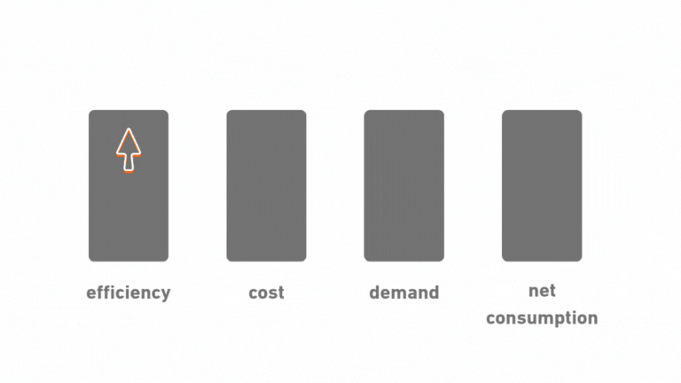

# ¿Me quitará la IA el trabajo? La Paradoja de Jevons

## TL;DR
- La mejora de eficiencia de las personas mediante el uso de la IA puede aumentar la demanda de trabajadores.
- Esa conclusión se extrae de la aplicación de La Paradoja de Jevons al contexto del impacto de la IA en el mundo laboral.
- Hay ciertas asunciones que se hacen para aplicar la Paradoja de Jevons, que podrían ser o no ser reales.
- Incluso en un escenario positivista, los costes de transición son reales, y las personas que no sean capaces de adaptarse pueden verse afectadas negativamente.

---

> Muchas de las veces que cuento que soy ingeniero de inteligencia artificial, la conversación deriva en las preguntas filosóficas y de impacto social que que vienen de la mano con el auge repentino de esta tecnología.

La más frecuente, sin duda, la preocupación sobre la persistencia de los trabajos actuales, y cómo se puede gestionar una potencial pérdida de las profesiones actuales.

El futuro es imposible de saber, pero he decidido explorar algunos de los factores que podrían influir en el curso que llevará el futuro con el innegable impacto de la inteligencia artificial. Hoy exploro el primero, uno, que además, auguraría un futuro prometedor.

---

## ¿Qué es la Paradoja de Jevons?

En 1865 William Stanley Jevons publicó "The Coal Question", un extensivo estudio sobre el consumo de carbón en Gran Bretaña y sus implicaciones económicas tanto a nivel nacional como internacional. Como parte de este estudio, valora el hecho de la mejora de la eficiencia de las máquinas de vapor, y cómo esto podía afectar al consumo del mineral:

> "Es una confusión de ideas total suponer que el uso económico del combustible es equivalente a un consumo reducido. Lo contrario es la verdad misma." 
[...]
"aumentar la eficiencia del carbón, y disminuir el costo de su uso, directamente tiende a aumentar el valor de la máquina de vapor, y a ampliar el campo de sus operaciones."

El tiempo dió la razón a Jevons, confirmando su teoría. ¿Por qué? La eficiencia hizo que las aplicaciones impulsadas por carbón fueran económicamente viables a escala masiva. Una operativa más barata significó más fábricas, más trenes, más aplicaciones, y en última instancia, un aumento neto del consumo.

Este inteligente análisis se ha generalizado y dado forma, para conformar lo que conocemos como la Paradoja de Jevons:

> "la introducción de tecnologías con mayor eficiencia energética puede, aumentar el consumo total de energía y, simultáneamente, llevar a un incremento de las emisiones."

**Esquemáticamente**:

### Otros ejemplos donde la Paradoja de Jevons se cumplió

En 1967 se instaló en Londres el primer cajero automático en del mundo. Las predicciones apuntaban a despidos masivos en las sedes bancarias.

El patrón se mantuvo. La automatización abarató las sucursales. Sucursales más baratas significaron más sucursales. Más sucursales significaron más empleos.

Otros ejemplos:
- Mecanismos de ahorro de agua que hacen que descuidemos más el consumo, aumentándolo al final.
- Las mejoras en las baterías de dispositivos han proliferado su uso, haciendo que el consumo de energía aumente.
- Incluso un ejemplo reciente, y que ya nos mete de lleno en la inteligencia artificial, el abaratamiento y mejora de eficiencia de los centros de datos, que simplemente han hecho que se creen centros mucho más masivos, aumentando el consumo de GPUs asociadas.
- El anuncio de DeepSeek R1 también fue un buen ejemplo en este campo, la empresa China hizo públicas nuevas técnicas mucho más eficientes de entrenar modelos de lenguaje, el mercado sobrerreaccionó, haciendo que el precio de las acciones de Nvidia se desplomase. Lejos de ver una disminución del uso de las GPUs de Nvidia, el mercado se abrió a nuevos competidores, en el largo plazo hemos visto como el Stock de Nvidia sigue subiendo y sus números en venta de GPUs siguen en alza.

---

## El Backlog Infinito

Cada empresa tiene un backlog de ideas que no son económicamente viables hoy, ya sea por restricciones económicas o por restricciones de capacidad o capital.

Para aplicar la Paradoja de Jevons en este escenario, asumimos que la eficiencia laboral de las personas se verá altamente incrementada por el uso de la IA. Esto potenciará la viabilidad de las ideas. Más ideas viables significan más proyectos. Más proyectos significan más demanda trabajadores, de super-humanos.

## Brotes verdes
El ejemplo reciente se ha visto en el mundo del software, la aplicación de técnicas de despidos masivos de desarrolladores fue hace aproximadamente dos años un eco constante en los medios. La inteligencia artificial ha seguido mejorando, especialmente en el campo de la programación, sin embargo ya no se habla de despidos masivos de desarrolladores, sino de un aumento de la demanda, de empresas que incrementan sus plantillas. Esto podrían ser los primeros indicadores de aplicación de la Paradoja de Jevons en el impacto de la inteligencia artificial.

---

## Brotes no tan verdes

Esto no es una ley universal. Hay condiciones claras donde la Paradoja de Jevons se rompe.

### Mercados de Demanda Fija

Operadores de ascensores. Cuando los ascensores se automatizaron, los empleos de operadores de ascensores desaparecieron. ¿Por qué? La demanda estaba limitada por el número de ascensores. No puedes tener más viajes en ascensor solo porque los operadores son más eficientes. El mercado no podía expandirse.

Cuando la demanda es fija, la eficiencia simplemente significa menos trabajadores.

### Sustitución Perfecta vs. Eficiencia

La Paradoja de Jevons requiere ganancias de eficiencia (humanos + IA), no sustitución perfecta (solo IA). Si la IA puede hacer tu trabajo 100% sin involucramiento humano, la paradoja seguramente no aplique.

### El coste de transición es real

Incluso si la demanda a largo plazo aumenta, la disrupción a corto plazo sucede. Las habilidades que importan cambian. Los trabajadores que no se adaptan enfrentan fricción. Aquellos que adoptan herramientas de IA y cambian el enfoque hacia problemas de nivel superior prosperan. La transición no es suave ni indolora, pero la tendencia a largo plazo favorece el aumento de demanda. 

En boca del CEO de Nvidia, Jensen Huang:
> "La IA no te va a quitar el trabajo, lo hará una persona que utilice la IA"

---

## Conclusión positiva: ¿Somos un data-center?

He mencionado antes que el caso del incremento de data centers es particularmente relevante. Pienso que en este caso, el mapeo mental es bastante inmediato. Podemos pensar que las CPUs y GPUs son unidades pensantes cuya eficiencia se ha incrementado enormemente, siguiendo la ley de Moore año tras año.

Si pensamos en las personas como unidades pensantes, podemos entender la IA como una vía de mejora de las personas, aumentando nuestra eficiencia. Esto pordría significar simplemente que seremos capaces de realizar muchas más tareas, reduciendo especialmente las tareas en las que la IA es buena, pero siempre trabajando como una unidad, es decir, siendo asistidos por ella, no reemplazados.

En este caso, la Paradoja de Jevons podría aplicarse, el data center que son las empresas podría llegar a requerir de más unidades pensantes, y por tanto hacer que el trabajo sea más requerido que nunca.

---

**Enlaces:**
- [William Stanley Jevons - The Coal Question (1865)](https://www.econlib.org/library/YPDBooks/Jevons/jvnCQ.html)
- [James Bessen - Investigación sobre cajeros automáticos y cajeros bancarios](https://www.jstor.org/stable/26652722)
- [Estudio de productividad de GitHub Copilot](https://github.blog/2022-09-07-research-quantifying-github-copilots-impact-on-developer-productivity-and-happiness/)
