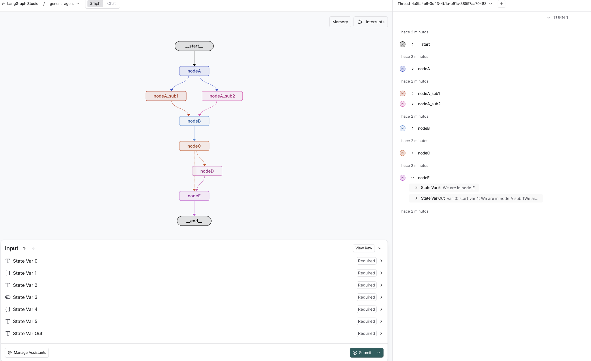
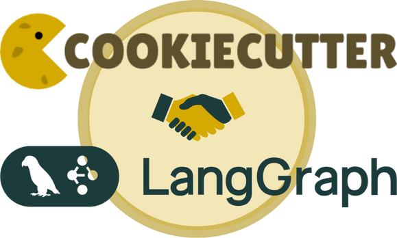

# Structuring AI Agent Projects for Production with LangGraph

The internet is drowning in AI agent demos: Jupyter notebooks with 500-line cells, a single `main.py` importing from `tools.py`, zero structure, zero production readiness. I've built and reviewed enough agent projects to know this doesn't scale past your first feature request.

After dozens of projects, I've landed on a layout that actually works—one that borrows from clean architecture, respects SOLID principles, and doesn't make you hate yourself when you need to add authentication or swap out an LLM provider. This is that structure, with a free Cookiecutter template to get you started in under a minute.

## Why Most Agent Projects Fall Apart

Three things kill agent projects early:

1. **Everything in one file** – Your graph definition, tools, API routes, and config all mashed together. Good luck debugging that at 2 AM.
2. **No development workflow** – You're editing code, rebuilding containers, and manually testing in production. Slow, brittle, painful.
3. **No separation of concerns** – Business logic, infrastructure, and presentation layers tangled up. Want to switch from OpenAI to Anthropic? Time to grep through 15 files.

If you've shipped agent code to production, you've felt this pain. Let's fix it.

## The Tech Stack

Here's what we're working with, from the outside in:


 **Docker** – Standardized runtime, reproducible across dev/staging/prod

 **uv** – Modern Python package manager; faster and more reliable than pip

 **FastAPI** – API framework with async support and automatic docs

 **Pydantic** – Data validation that actually catches bugs before runtime

 **LangGraph** – Agent workflow orchestration with built-in dev tools


## The Project Structure

Here's the full layout. I'll break down each piece below.

```
project-root/
├── app/                    # Everything that ships
│   ├── application/        # Use cases & workflows
│   ├── config/            # Settings & environment
│   ├── domain/            # Business logic
│   ├── infrastructure/    # External services (LLMs, DBs)
│   ├── routes/            # FastAPI endpoints
│   └── main.py            # Application entry point
├── notebooks/             # Exploratory work (kept, not shipped)
├── static/                # Docs, images, diagrams
├── .env                   # Local secrets (never commit)
├── .env.example           # Template for required vars
├── .gitignore
├── .python-version
├── CHANGELOG.md
├── Dockerfile
├── langgraph.json         # LangGraph dev UI config
├── Makefile               # Underrated undercover documentation
├── pyproject.toml
├── README.md
└── uv.lock
```

### The `app/` directory (What Ships)

This is your production code. Clean separation:

- **`application/`** – Use cases and LangGraph workflows. Each workflow is self-contained: graph definition, nodes, edges. Basically here goes the business logic, the way to solve the use case.
- **`domain/`** – Core business entities and services. No framework dependencies, pure Python.
- **`infrastructure/`** – Adapters for external systems: LLM clients, databases, APIs. Swap implementations without touching business logic.
- **`routes/`** – FastAPI endpoints. Thin layer that calls use cases.
- **`config/`** – Environment variables, feature flags, settings. Single source of truth. For this I love working with pydantic-settings library.

**Why this works:** When you need to add a new agent, you drop a workflow in `application/`, wire it up in `routes/`, done. No hunting through tangled imports.

### The `notebooks/` directory (Keep Your Explorations)

Every project starts messy—connecting to APIs, exploring data, testing prompts. Most people trash these notebooks once they "productionize." Don't.

Save them in `notebooks/`. When you need to add a feature six months later, or when a new dev joins, these explorations save hours. Credit to [@Miguel Otero](https://www.linkedin.com/in/miguel-otero-perez/) for drilling this into my head.

### Configuration Files (The Boring Stuff That Matters)

- **`.env` / `.env.example`** – Real secrets go in `.env` (gitignored). `.env.example` shows the shape without leaking keys.
- **`.python-version`** – Locks Python version. uv and pyenv read this automatically.
- **`Dockerfile`** – Simple multi-layer build. Layer caching makes rebuilds fast. (Multi-stage builds are overkill unless you're optimizing image size for CI.)
- **`langgraph.json`** – Tells LangGraph's dev UI where to find your graphs. Run `make dev` and get a local LangSmith-like interface.
- **`Makefile`** – Better than a README. Every command you run is here: `make dev`, `make test`, `make docker-build`. New devs run `make` and see what's possible.

**Pitfall:** Don't skip `.env.example`. Six months from now, you'll forget which vars are required, and so will your teammates.

## The `app/` Internals (Clean Architecture, Lite)

Let's zoom into `app/application/workflows/`. Here's a sample agent:

```python
# app/application/workflows/chat/graph.py
from langgraph.graph import StateGraph, END
from app.domain.entities import ChatState
from app.infrastructure.llm_service import LLMService

def build_chat_graph(llm_service: LLMService):
    graph = StateGraph(ChatState)
    
    graph.add_node("agent", lambda state: llm_service.generate(state))
    graph.add_edge("agent", END)
    
    return graph.compile()
```

The workflow knows nothing about OpenAI or Anthropic. `LLMService` is an abstraction in `infrastructure/`. Swap providers by changing one class.

In `routes/`:

```python
# app/routes/v1/chat.py
from fastapi import APIRouter
from app.application.chat import ChatUseCase

router = APIRouter()

@router.post("/chat")
async def chat(request: ChatRequest):
    use_case = ChatUseCase()
    return await use_case.execute(request)
```

Thin routes. Use cases contain logic. Easy to test, easy to trace.

## Development Workflow

The Makefile drives everything. Here's mine:

```makefile
.PHONY: dev test docker-build docker-run langgraph-dev

dev:
	uv run fastapi dev app/main.py

langgraph-dev:
	uv run langgraph dev

docker-build:
	docker build -t agent-app .

docker-run:
	docker run -p 8000:8000 --env-file .env agent-app
```
### Agents development

Run `make langgraph-dev` and you get a visual graph UI at `https://smith.langchain.com/studio/?baseUrl=http://127.0.0.1:2024`. Test nodes, inspect state, replay executions. It's like LangSmith but self-hosted and free.



### Logging

Logging in python is a whole world by itself, to avoid headaches and complex logging setups, I recommend using [loguru](https://loguru.readthedocs.io/en/stable/) library. It's simple, easy to use and it's a single dependency. The project already has it configured.

## Common Pitfalls

1. **Mixing business logic and infrastructure** – Keep `domain/` pure. No imports from `infrastructure/`. Use dependency injection.
2. **Skipping the Makefile** – "I'll remember the commands" – No you won't. Write it down.
3. **Committing `.env`** – Add it to `.gitignore` immediately. Leaked keys are a nightmare.
4. **Ignoring notebooks/** – Archive your explorations. Future you will thank you.
5. **Over-engineering early** – Start simple. You don't need multi-stage Docker builds or a service mesh on day one.

## The Cookiecutter Template



I got tired of copying this structure manually, so I built a [Cookiecutter template](https://github.com/hugoromerorico/production-agent-cookiecutter-langgraph). It generates the entire layout with one command:

```bash
cookiecutter https://github.com/hugoromerorico/production-agent-cookiecutter-langgraph
```

Answer a few questions (project name, author, Python version) and you're done. No decision fatigue, no bikeshedding about folder names.

The template includes:
- Pre-configured `Makefile` with common commands
- Sample chat and generic agent workflows
- Docker setup with layer caching
- FastAPI boilerplate with versioned routes
- LangGraph dev UI config

Clone it, run `make dev`, and you're coding in under a minute.

## Results

Here's what you get with this structure:

- **Fast iteration** – `make langgraph-dev` for visual debugging, `make dev` for API hot-reload
- **Easy onboarding** – New devs run `make`, read the `Makefile`, and understand the project
- **Low coupling** – Swap LLM providers, databases, or even frameworks without rewriting business logic
- **Production-ready** – Docker images, environment management, and clear separation of concerns from day one

I've used this on projects ranging from weekend hacks to client production systems. It scales.

## Takeaways

- Structure agent projects like real software: separate concerns, inject dependencies, keep business logic clean
- Save your notebooks—they're documentation of your decision-making process
- A good Makefile is better than a README for understanding what a project does
- Use LangGraph's dev UI for debugging; it's a game-changer
- Don't reinvent the wheel—use the Cookiecutter template and get building

---

**Links:**
- [Cookiecutter template](https://github.com/hugoromerorico/production-agent-cookiecutter-langgraph)
- [Docker docs](https://www.docker.com/)
- [uv package manager](https://docs.astral.sh/uv/)
- [FastAPI](https://fastapi.tiangolo.com/)
- [Pydantic](https://docs.pydantic.dev/)
- [LangGraph](https://langchain-ai.github.io/langgraph/)