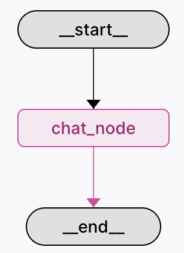
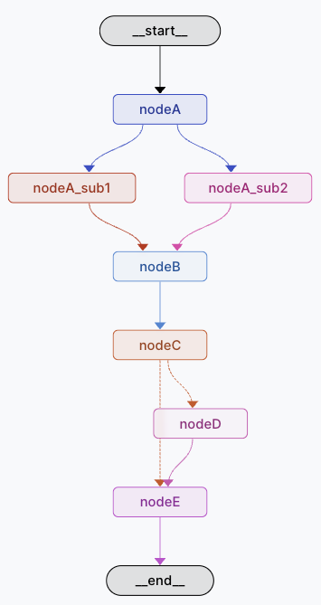

# Structuring AI Agent Projects for Production with LangGraph

The internet is drowning in AI agent demos: Jupyter notebooks with 500-line cells, a single `main.py` importing from `tools.py`, zero structure, zero production readiness. I've built and reviewed enough agent projects to know this doesn't scale past your first feature request.

After dozens of projects, I've landed on a layout that actually works—one that borrows from clean architecture, respects SOLID principles, and doesn't make you hate yourself when you need to add authentication or swap out an LLM provider. This is that structure, with a free Cookiecutter template to get you started in under a minute.

## Why Most Agent Projects Fall Apart

Three things kill agent projects early:

1. **Everything in one file** – Your graph definition, tools, API routes, and config all mashed together. Good luck debugging that at 2 AM.
2. **No development workflow** – You're editing code, rebuilding containers, and manually testing in production. Slow, brittle, painful.
3. **No separation of concerns** – Business logic, infrastructure, and presentation layers tangled up. Want to switch from OpenAI to Anthropic? Time to grep through 15 files.

If you've shipped agent code to production, you've felt this pain. Let's fix it.

## The Tech Stack

Here's what we're working with, from the outside in:


 **Docker** – Standardized runtime, reproducible across dev/staging/prod

 **uv** – Modern Python package manager; faster and more reliable than pip

 **FastAPI** – API framework with async support and automatic docs

 **Pydantic** – Data validation that actually catches bugs before runtime

 **LangGraph** – Agent workflow orchestration with built-in dev tools


## The Project Structure

Here's the full layout. I'll break down each piece below.

```
project-root/
├── app/                    # Everything that ships
│   ├── application/        # Use cases & workflows
│   ├── config/            # Settings & environment
│   ├── domain/            # Business logic
│   ├── infrastructure/    # External services (LLMs, DBs)
│   ├── routes/            # FastAPI endpoints
│   └── main.py            # Application entry point
├── notebooks/             # Exploratory work (kept, not shipped)
├── static/                # Docs, images, diagrams
├── .env                   # Local secrets (never commit)
├── .env.example           # Template for required vars
├── .gitignore
├── .python-version
├── CHANGELOG.md
├── Dockerfile
├── langgraph.json         # LangGraph dev UI config
├── Makefile               # Underrated undercover documentation
├── pyproject.toml
├── README.md
└── uv.lock
```

### The `app/` directory (What Ships)

This is your production code. Clean separation:

- **`application/`** – Use cases and LangGraph workflows. Each workflow is self-contained: graph definition, nodes, edges. Basically here goes the business logic, the way to solve the use case.
- **`domain/`** – Core business entities and services. No framework dependencies, pure Python.
- **`infrastructure/`** – Adapters for external systems: LLM clients, databases, APIs. Swap implementations without touching business logic.
- **`routes/`** – FastAPI endpoints. Thin layer that calls use cases.
- **`config/`** – Environment variables, feature flags, settings. Single source of truth. For this I love working with pydantic-settings library.

**Why this works:** When you need to add a new agent, you drop a workflow in `application/`, wire it up in `routes/`, done. No hunting through tangled imports.

### The `notebooks/` directory (Keep Your Explorations)

Every project starts messy—connecting to APIs, exploring data, testing prompts. Most people trash these notebooks once they "productionize." Don't.

Save them in `notebooks/`. When you need to add a feature six months later, or when a new dev joins, these explorations save hours. Credit to [@Miguel Otero](https://www.linkedin.com/in/miguel-otero-perez/) for drilling this into my head.

### Configuration Files (The Boring Stuff That Matters)

- **`.env` / `.env.example`** – Real secrets go in `.env` (gitignored). `.env.example` shows the shape without leaking keys.
- **`.python-version`** – Locks Python version. uv and pyenv read this automatically.
- **`Dockerfile`** – Simple multi-layer build. Layer caching makes rebuilds fast. (Multi-stage builds are overkill unless you're optimizing image size for CI.)
- **`langgraph.json`** – Tells LangGraph's dev UI where to find your graphs. Run `make dev` and get a local LangSmith-like interface.
- **`Makefile`** – Better than a README. Every command you run is here: `make dev`, `make test`, `make docker-build`. New devs run `make` and see what's possible.

**Pitfall:** Don't skip `.env.example`. Six months from now, you'll forget which vars are required, and so will your teammates.

## Design Principles

This structure follows a few key principles:

1. **Dependency Direction** – Business logic (`domain/`) doesn't know about infrastructure. Dependencies point inward, not outward.
2. **Separation of Concerns** – Each directory has one job. Workflows orchestrate, infrastructure connects, routes expose APIs.
3. **Easy Testing** – Pure business logic in `domain/`, injected dependencies in `application/`, thin routes. Mock the edges, test the core.
4. **Developer Experience** – Clear structure means new team members know where things go. No hunting through tangled imports.

**Key Architecture Rule:** `domain/` is pure Python—no framework dependencies, no external service calls. Everything else adapts to serve the domain.

## Common Pitfalls to Avoid

1. **Mixing business logic and infrastructure** – Keep `domain/` pure. No imports from `infrastructure/`. Use dependency injection.
2. **Ignoring notebooks/** – Archive your explorations. Future you will thank you.
3. **Over-engineering early** – Start simple. Add complexity only when needed.
4. **Skipping documentation** – Document your commands, environment variables, and design decisions as you go.
5. **Skipping the Makefile** – "I'll remember the commands" – No you won't. Write it down.

## The Cookiecutter Template


Rather than manually recreating this structure for each project, I built a [Cookiecutter template](https://github.com/hugoromerorico/production-agent-cookiecutter-langgraph) that generates everything in one command:

```bash
cookiecutter https://github.com/hugoromerorico/production-agent-cookiecutter-langgraph
```

Answer a few questions (project name, author, Python version) and you get a fully configured project with the structure above.

The template includes everything you need to start building immediately:
- Complete folder structure following the layout described above
- Pre-configured development tooling (Docker, Makefile, etc.)
- FastAPI boilerplate with versioned routes
- Two example LangGraph workflows to learn from and build upon
- Environment management and configuration setup

**Important:** The included workflows are intentionally simple examples—a basic chat agent and a generic multi-node workflow. They're not production-ready solutions, but rather starting points that demonstrate LangGraph patterns and the architecture in action. Use them as templates to understand the structure, then replace them with your actual use cases.

## What You Actually Get

Let's look at what comes out of the box and how to use it.

### Example Workflows

The template includes two sample LangGraph workflows that demonstrate different patterns:

**Chat Agent** – A simple conversational agent with a single node:



This minimal workflow shows the basics: state management, LLM integration, and clean separation from infrastructure. Perfect for understanding the fundamentals before adding complexity.

**Generic Agent** – A multi-node workflow with parallel execution and conditional routing:



This more complex example demonstrates parallel node execution, state aggregation, and conditional branching. Use it as a template for building sophisticated multi-step agents.

Both workflows live in `app/application/workflows/` and follow the same pattern:
- **`graph.py`** – Defines the LangGraph structure (nodes, edges, state)
- **`nodes.py`** – Contains node functions with business logic
- **`state.py`** – Pydantic models for typed state management

Here's how a workflow is structured:

```python
# app/application/workflows/chat/graph.py
from langgraph.graph import StateGraph, END
from app.domain.entities import ChatState
from app.infrastructure.llm_service import LLMService

def build_chat_graph(llm_service: LLMService):
    graph = StateGraph(ChatState)
    
    graph.add_node("agent", lambda state: llm_service.generate(state))
    graph.add_edge("agent", END)
    
    return graph.compile()
```

Notice: The workflow knows nothing about which LLM provider you're using. `LLMService` is an abstraction that lives in `infrastructure/`, making it trivial to swap from OpenAI to Anthropic or any other provider.

Routes are equally clean:

```python
# app/routes/v1/chat.py
from fastapi import APIRouter
from app.application.chat import ChatUseCase

router = APIRouter()

@router.post("/chat")
async def chat(request: ChatRequest):
    use_case = ChatUseCase()
    return await use_case.execute(request)
```

Thin routes that delegate to use cases. Easy to test, easy to trace through the stack.

### The Makefile (Your Command Center)

Every command you'll run is documented in the Makefile:

```makefile
.PHONY: dev test docker-build docker-run langgraph-dev

dev:
	uv run fastapi dev app/main.py

langgraph-dev:
	uv run langgraph dev

docker-build:
	docker build -t agent-app .

docker-run:
	docker run -p 8000:8000 --env-file .env agent-app
```

Run `make` with no arguments and you'll see all available commands. New developers don't need to read documentation—they just run `make` and understand what's possible.

**Pro tip:** The Makefile is better documentation than a README. Commands are self-documenting and guaranteed to be up-to-date (because they're what you actually run).

### LangGraph Development UI

Run `make langgraph-dev` and you get a visual interface at `https://smith.langchain.com/studio/?baseUrl=http://127.0.0.1:2024`:


This interface lets you:
- Visualize your graph structure in real-time
- Test individual nodes with custom inputs
- Inspect state at each step
- Replay and debug executions
- Iterate without restarting your server

It's like having LangSmith locally and free. Essential for development.

### Logging with Loguru

The template comes with [loguru](https://loguru.readthedocs.io/en/stable/) pre-configured. Python's built-in logging is powerful but overcomplicated for most projects. Loguru gives you:

```python
from loguru import logger

logger.info("Simple logging that just works")
logger.error("Automatic exception capture with context")
```

One dependency, zero configuration headaches, excellent defaults. The project has it wired up and ready to use.

## Why This Works

This structure delivers real benefits across the development lifecycle:

- **Fast iteration** – Visual debugging with LangGraph UI, hot-reload with FastAPI, no waiting on Docker rebuilds during development
- **Easy onboarding** – New developers run `make` and immediately understand available commands. The structure is self-documenting.
- **Low coupling** – Swap LLM providers, databases, or frameworks without touching business logic. Dependencies point inward.
- **Production-ready from day one** – Docker images, environment management, and separation of concerns built in. No "later we'll refactor for production."

I've used this structure on projects ranging from weekend prototypes to client production systems serving real users. It scales both up (adding features) and down (starting simple).

## Takeaways

- **Structure matters** – Agent projects are software. Apply the same principles you'd use for any production system: separate concerns, inject dependencies, keep core logic pure.
- **Save your notebooks** – They're living documentation of your exploration and decision-making. Future you will need them.
- **Example code is for learning** – The cookiecutter workflows are intentionally simple. Study them, understand the patterns, then replace them with your actual use cases.
- **Tooling accelerates development** – LangGraph's visual UI is a game-changer for debugging. Use it.
- **Start building, don't bikeshed** – Use the Cookiecutter template and get to the actual problem. The structure is solved.

---

**Links:**
- [Cookiecutter template](https://github.com/hugoromerorico/production-agent-cookiecutter-langgraph)
- [Docker docs](https://www.docker.com/)
- [uv package manager](https://docs.astral.sh/uv/)
- [FastAPI](https://fastapi.tiangolo.com/)
- [Pydantic](https://docs.pydantic.dev/)
- [LangGraph](https://langchain-ai.github.io/langgraph/)